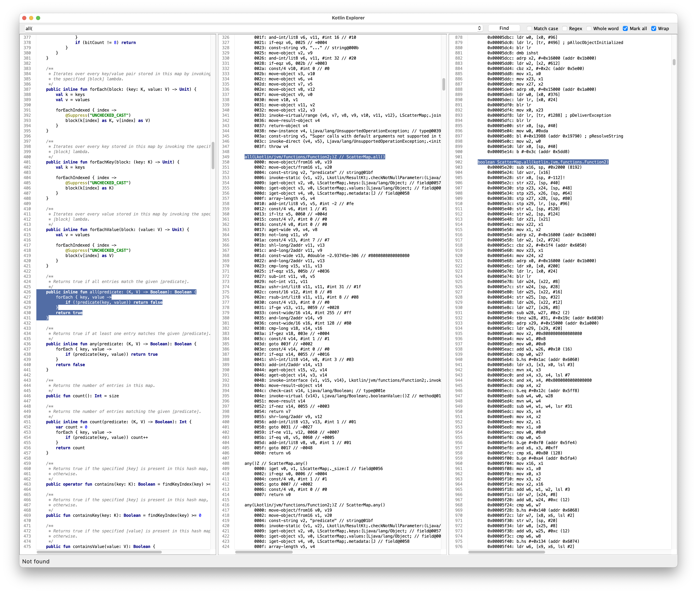

# Kotlin Explorer

Kotlin Explorer is a desktop tool to quickly and easily disassemble Kotlin code into:
- Java bytecode
- Android DEX bytecode
- Android OAT assembly

After launching Kotlin Explorer, type valid Kotlin code in the left pane, then click
*Build > Build & Disassemble* or use `Cmd-Shift-D` on macOS, `Ctrl-Shift-D`
on Linux and Windows.

By default, the middle pane will show the Android DEX bytecode, and the right panel
the native assembly resulting from ahead of time compilation (AOT). You can control
which panels are visible using the *View* menu.

# Features

- *Build > Run*: compile the Kotlin source code and run it locally. Any output is sent
  to the logs panel.
- *Build > Optimize with R8*: turn on R8 optimizations. Turning this on will affect the
  ability to see corresponding source line numbers in the byte code and DEX outputs.
- *View > Sync Lines*: synchronize the current line in the source, byte code, and DEX
  panels. This feature may require R8 optimizations to be turned off to work properly.
- *View > Presentation Mode*: increase the font size to make the content more visible
  when projected.
- *Build > Build on Startup*: to automatically launch a compilation when launching the
  app.
- Clicking a jump instruction will show an arrow to the jump destination.
- Shows the number of instructions and branches per method.

# Running Kotlin Explorer

Kotlin Explorer needs to be told where to find the Android SDK and the Kotlin compiler.
Unless you've set `$ANDROID_HOME` and `$KOTLIN_HOME` properly, Kotlin Explorer will ask
you to enter the path to those directories.

For `$ANDROID_HOME`, use the path to the root of the Android SDK (directory containing
`build-tools/`, `platform-tools/`, etc.). Android Studio for macOS stores this in
`$HOME/Library/Android/sdk`.

For `$KOTLIN_HOME`, use the path to the root of your
[Kotlin installation](https://kotlinlang.org/docs/command-line.html). This directory
should contain `bin/kotlinc` and `lib/kotlin-stdlib-*.jar` for instance.

Kotlin explorer also requires `java` and `javap` to be in your `$PATH`.

> [!IMPORTANT]  
> DEX bytecode and OAT assembly will only be displayed if you have an Android
> device or emulator that can be successfully reached via `adb`. The device
> must be recent enough to host the `oatdump` tool on its system image.

# License

Please see [LICENSE](./LICENSE).
